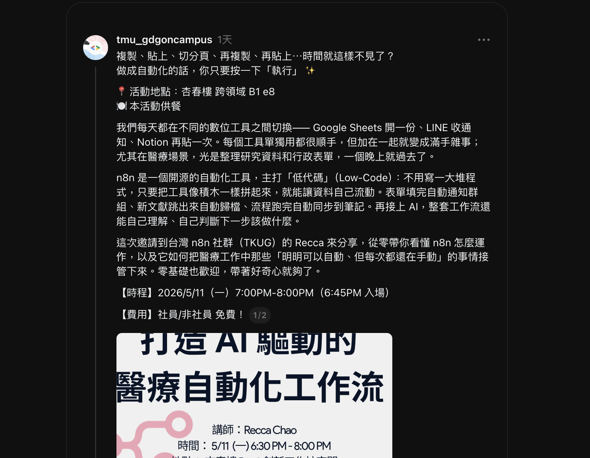
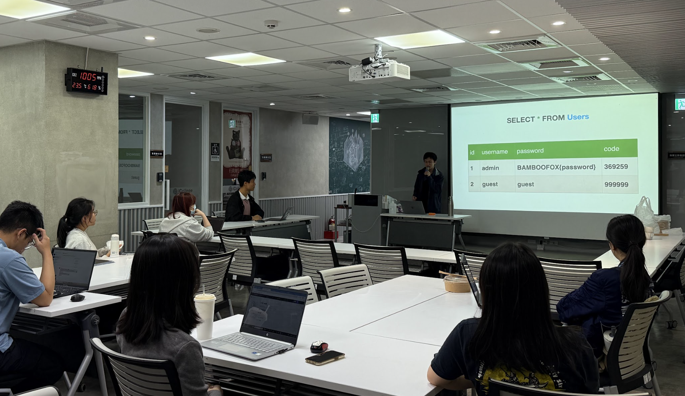
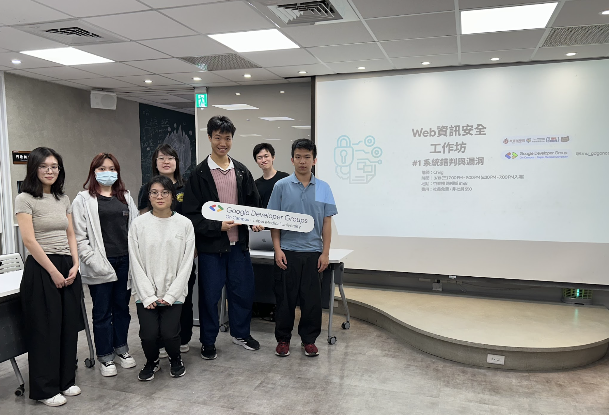
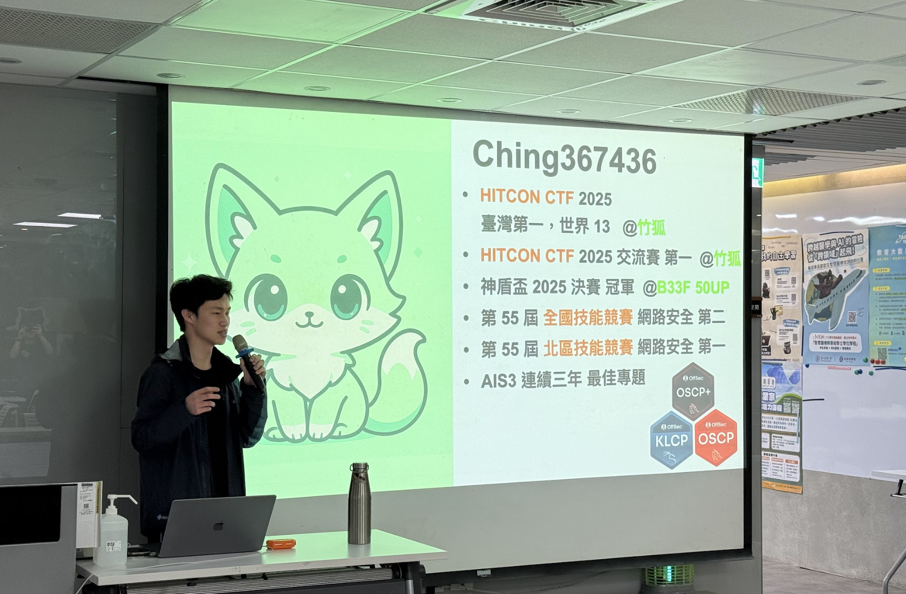

# B13｜Web 資訊安全工作坊 #1：系統錯判與漏洞 結案報告

## 一、活動基本資訊

| 項目 | 內容 |
|------|------|
| 活動名稱 | Web 資訊安全工作坊 #1：系統錯判與漏洞 |
| 活動日期 | 中華民國 115 年 3 月 18 日（三）19:00–21:00（18:30 開始入場）|
| 活動地點 | 臺北醫學大學 杏春樓 跨領域 B1 e8 |
| 主辦單位 | GDG on Campus TMU |
| 協辦單位 | 跨領域學習中心、Smart TMU |
| 活動對象 | 對「網站／系統運作」或「資訊安全」有點好奇的學生 |
| 實際參與人數 | **Bevy 平台 RSVP：10 人**（其中 4 名非社員 × 50 元 = 200 元）|
| 費用 | 社員免費／非社員 50 元 |
| 講師 | **Ching**（資安戰隊「竹狐」隊長）|
| 講師費 | 2,500 元（核銷中）|
| 膳食支出 | 1,200 元（已核銷撥款）|

## 二、講師資歷（堪稱本年度最頂規）

> **Ching**（資安戰隊竹狐隊長）
> - HITCON CTF 2025 交流賽 第一名
> - HITCON Quals 2025 臺灣第一 / 世界第 13
> - 國家中山科學研究院 神盾盃 2025 第一名
> - 第 55 屆 全國技能競賽 網路安全 第二名
> - 第 55 屆 北區技能競賽 網路安全 第一名
> - 第 22 屆 ATCC 全國大專院校商業個案大賽 全國總冠軍 等多個獎項
> - 擁有 OffSec OSCP+ / KLCP / OSWP 等多張專業資安證照
> - 曾擔任交大網路安全策進會 BambooFox、資通安全研究院 CTF Workshop、SCIST、COSCUP、臺灣好厲駭 Training 等講師

> **意義**：本社年度能邀請到神盾盃 2025 全國第一名（與本社隊伍同場競賽且為其前者）親自授課，展現本社作為 GDGoC 在跨社群連結上的深度。

## 三、活動目的與宗旨

呼應社團發展計畫之「**醫療×科技跨領域應用**」重點，並延續本社 3/02「嗶一下的秘密」資安工作坊主題系列。本場為 Web 資安系列三部曲第一場：

1. 從常見 Web 漏洞出發，理解為什麼會出現、系統哪裡出了問題
2. 以簡單例子與示範，認識真實世界中為何在意這些情境
3. 適合對「網站／系統運作」或「資訊安全」有點好奇的學員

## 四、活動內容

### 主題 #1：系統錯判與漏洞

**SQL Injection（SQL 注入）**
- 原理：透過惡意輸入改變查詢邏輯
- 案例：「不用密碼也能登入成功」

**Race Condition（競爭條件）**
- 原理：利用系統處理順序的時間差，執行額外操作
- 案例：「同一筆優惠被領兩次」

當網站把使用者輸入送進資料庫時，如果設計不夠嚴謹，查詢邏輯可能被改變。本場用簡單案例認識 SQL Injection 原理，並看看當系統同時處理多個操作時，為什麼「時間差」也可能造成漏洞。

## 五、SDGs 永續發展對應

- **SDG 4 優質教育**：把國家級資安講師帶入校園
- **SDG 9 產業創新**：培養下一代資安人才
- **SDG 17 多元夥伴關係**：與 HITCON、神盾盃 2025 第一名講師連結

## 六、AI 技術應用

- **講師備課**：HITCON 講師資源、CTF 經典題庫
- **學員實作支援**：Capture The Flag (CTF) 平台練習
- **宣傳**：Gemini 生成多版本 IG 貼文

## 七、回饋分析（依「場次#1 (Responses).xlsx」共 2+ 份回應）

| 維度 | 數據 |
|------|------|
| **整體滿意度** | **5.00 / 5**（n=2，滿分回饋）|

**代表性回饋（學員實際填寫）**：

| 「這場講座讓您有什麼收穫或啟發？」 | 「印象最深刻的部分」 |
|-----------------------------------|---------------------|
| 「html, CSS 的一些用法在 notion 有用過 但今天才知道是什麼」 | 「html, CSS」 |
| 「很有趣的分享，學到很多酷東西👍🏻」 | 「第一次體驗到 capture the flag 還蠻有趣的」 |

## 八、活動檢討會議

於 4/03 第 9 次幹部會議檢討：
- **正面**：講師等級頂規、滿分回饋、CTF 體驗成功引發學員興趣
- **改進**：場次 #2 持續延續系列、考慮製作系列宣傳整合貼文

## 九、活動照片與佐證

---

<!-- ## 附件

- 場次#1 回饋表單（Responses.xlsx）
- 簽到單
- 活動照片
- 講師簡介文件 -->
